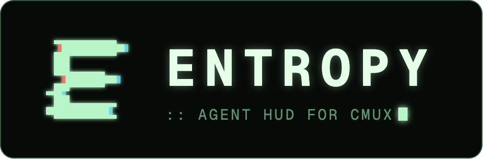
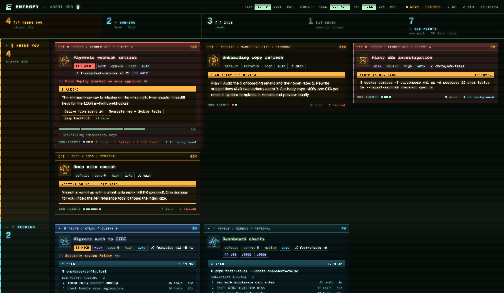

<p align="center">
  
</p>

<p align="center">
  <b>Every coding agent across all your <a href="https://cmux.com">cmux</a> windows, on one screen.</b><br>
  See which agent needs you and why, then click its card to jump to its terminal.
</p>



<sub>Screenshot uses the bundled demo data. All projects and prompts in it are made up.</sub>

## Why

Once you run more than a few agents, the hard part is noticing which one stopped to ask you something. cmux's own sidebars only see the window they're in. Entropy reads cmux's app-wide socket instead, so a single page covers every window. Put it on a second monitor and leave it there.

- **Needs you first.** Permission prompts, open questions, plans waiting for review, and finished turns you haven't read yet. Each card shows what the agent is asking, so you can decide before you switch to it.
- **Click to jump.** Clicking a card focuses that agent's cmux window and terminal.
- **A shape per workspace.** Each workspace gets its own spinning wireframe solid, so you can tell projects apart at a glance.
- **Context on every card:** the last prompt and reply, the running tool, todo progress, sub-agents, model and effort, branch, ahead/behind, changed files, PRs, ports, CPU and memory.
- **Priority flags.** You or an agent can mark a session urgent, high or low, and it sorts accordingly.
- **Day in review.** A timeline and rollup of the day's sessions, built from the agents' transcripts.
- **Three layouts:** Board (one lane per status), List, and Day. Full and Compact density, plus an optional CRT effect.
- **No dependencies.** A single Python file using only the standard library, with a single-file web page. Nothing to build.

## Install

Requirements: macOS, [cmux](https://cmux.com), and `python3`.

```sh
git clone https://github.com/elevationgain/entropy.git ~/entropy
~/entropy/install.sh
entropy window
```

`install.sh` symlinks `bin/entropy` into `~/.local/bin` and the sidebar into `~/.config/cmux/sidebars`. Run `./install.sh --uninstall` to remove both links.

Claude Code sessions started in cmux report their state automatically. For other agents, run `cmux hooks setup`. Entropy uses `git` and `ps` when they're available to add detail to cards.

**Try it without cmux:** open `web/index.html` directly in a browser. It loads the demo data shown in the screenshot.

## Use

| Command | What it does |
|---|---|
| `entropy window` | Opens a new cmux window with the server in one tab and the HUD in another. |
| `entropy` / `entropy serve` | Serves the HUD at http://127.0.0.1:7878. Use `--port` to change the port. |
| `entropy priority <urgent\|high\|low\|normal> [reason]` | Flags the calling agent's session for attention. |
| `entropy tui` | Terminal version: `j`/`k` to move, Enter to jump, `e` to toggle ended sessions, `q` to quit. |
| `cmux right-sidebar set custom entropy` | In-window sidebar. It shows only that window's agents. |

Click a lane's label to collapse the lane into one chip per agent. Cards use each workspace's cmux color and its sidebar status pills. The browser remembers your view settings.

### Priority

```sh
entropy priority urgent "prod deploy blocked on your approval"
entropy priority low "long refactor, no rush"
entropy priority normal            # clear
```

When you run it inside an agent's terminal, it targets that session automatically through `$CLAUDE_CODE_SESSION_ID` or `$CMUX_SURFACE_ID`. From anywhere else, pass `--session` or `--surface`. Urgent cards get a red outline, high cards get a badge, and low cards sink and dim. A flag clears the next time you prompt that session; add `--sticky` to keep it. This means an agent can tell you it's blocked, for example from a hook or a skill.

## Privacy

Everything stays on your machine. The server binds to `127.0.0.1` and has no authentication. Its `/state` endpoint includes prompt and reply text from your sessions. `--host 0.0.0.0` exposes the HUD to your LAN. Use it only on networks you trust.

## How it works

Entropy builds each agent's state from cmux's event stream and session list. It applies the same state rules as cmux itself:

| Event | State |
|---|---|
| SessionStart, Stop | idle |
| Prompt submitted, tool used | working |
| Permission request, question, plan ready, notification | needs you |
| SessionEnd | ended |

Two overlays sit on top of those rules:

- An agent that finished its turn stays in **needs you** ("Done · unread") until you view its terminal.
- An agent stopped by a session limit keeps its lane and gets a callout showing when the limit resets.

<details>
<summary>Data sources</summary>

| Source | Gives |
|---|---|
| `cmux events --category agent --category feed` | Live hook events, replayed since cmux started. These drive each agent's state. |
| `cmux sessions --json` | Sessions older than the event buffer: pid, account, transcript path. |
| `cmux rpc mobile.workspace.list` | Every window's workspaces and tabs. |
| `cmux rpc extension.sidebar.snapshot` | Branch, ports, PR URLs, latest notification, per window. |
| `cmux rpc notification.list` | Notification text for each terminal. |
| Claude transcript JSONL | Title, prompts and replies, pending tool, question or plan, todos, model, tokens, files edited. |
| `ps`, `git status` | CPU and memory; ahead/behind, changed files, last commit. |

HTTP endpoints: `GET /` (the page), `GET /state` (JSON snapshot), `GET /stream` (server-sent events), `POST /jump {wid, surface}`, `POST /priority {session|surface, level, reason, sticky}`.

</details>

## Develop

- `web/index.html` holds the whole UI. Edit it and reload the tab; you don't need to restart the server.
- `bin/entropy` holds the engine and server. Restart `entropy serve` after you change it.
- `curl -s localhost:7878/state | jq` shows the payload the page renders.
- `http://127.0.0.1:7878/?fixture` renders the demo data. To regenerate it, run `tools/make_fixture.py`.

See [docs/ROADMAP.md](docs/ROADMAP.md) for what's next.

## License

[MIT](LICENSE)
